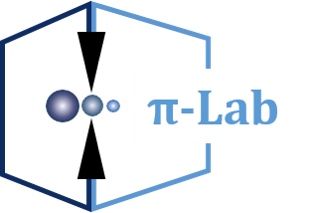

# XMe-DataAnalysis

This is a Single-Molecule Break Junctions experiment data processing software built with [Python](https://www.python.org) and [PyQt5](https://riverbankcomputing.com/software/pyqt/download5), licensed under the [Apache 2.0](LICENSE).

## Environmental requirements
* Windows10
* python(3.8+)

## Download software  
Please click [here](https://github.com/Pilab-XMU/XMe_DataAnalysis/releases) to download the data processing software.

## User Guide  

Please click [here](https://github.com/Pilab-XMU/XMe_DataAnalysis/tree/shangchi/guide)to read user guide.

## ISSUES  
If there are any problems during use, 
please [issue](https://github.com/Pilab-XMU/XMe_DataAnalysis/issues) or contact me by `email(shangchixmu@stu.xmu.edu.cn)`

## LICENSE
The users of XMe code should state "The data is analyzed by XMe open-source code(github.com/Pilab-XMU/XMe_DataAnalysis) by Prof. Wenjing Hong's group in Xiamen University." in the desciption of experimental method in the paper, and cite 3 references in the paper as follows:

1. Liu, J.; …Hong, W., Transition from tunneling leakage current to molecular tunneling in single-molecule junctions, Chem, 2019, 5, 390-401.
2. Bai, J.; …Hong, W., Anti-resonance features of destructive quantum interference in single-molecule thiophene junctions achieved by electrochemical gating, Nature Materials, 2019, 18, 364–369.
3. Tang, C.; …Hong, W., Multicenter-Bond-Based quantum interference in charge transport through single-molecule carborane junctions, Angewandte Chemie International Editions, 2019, 58 (31), 10601-10605.

For the use of the clustering algorithm, please also refer to the reference of Reference 4-5:

4. Lin, L.; …Hong, W., Spectral Clustering to Analyze the Hidden Events in Single-Molecule Break Junctions, The Journal of Physical Chemistry C, 2021, 125(6), 3623–3630
5. Huang, F.; …Hong, W., Automatic classification of single-molecule charge transport data with an unsupervised machine-learning algorithm, Physical Chemistry Chemical Physics, 2020, 22, 1665-1673.

For the analysis of PSD flicker noise analysis, please also refer to Reference 6:

6. Pan, Z.; …Hong, W., The evolution of charge transport mechanism in single-molecule break junction revealed by the flicker noise analysis, Small, 2021, DOI: 10.1002/smll.202107220    
## AUTHOR
- Shang Chi,`email(shangchixmu@stu.xmu.edu.cn)`
- Gang Dong,`email(gangdong@stu.xmu.edu.cn)`
- Ruihao Li,`email(lrhxmu@stu.xmu.edu.cn)`
- Zhichao Pan,`email(need fill)`
- Luchun Lin,`email(need fill)`
- Wenjing Hong,`email(need fill)`
