# Introductions

 link：https://github.com/Pilab-XMU/XMe_DataAnalysis

## basic analysis

### 1. download

address：https://github.com/Pilab-XMU/XMe_DataAnalysis/releases

Download the latest version of the exe file from github and place it in the local directory (preferably an English path).

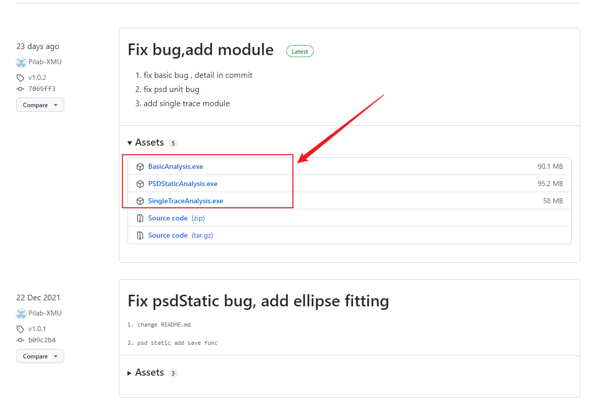

### 2. Start

After downloading, the program can be started without installation.

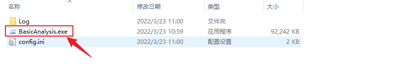

### 3. Set fitting parameters

- Please select the appropriate instrument and modify the fitting parameters in **Fitting_Set** panel. 
  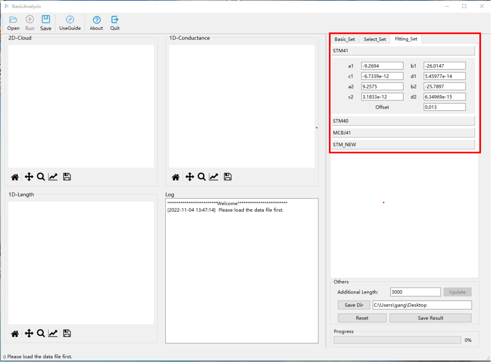

- And then you must select the corresponding instrument in the **device** option of the **Basic_Set** panel.
  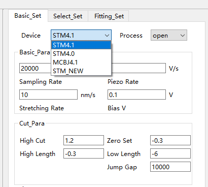

  

### 4. Set processing parameters

- Please modify the parameters of the two parts in the following figure as needed.
  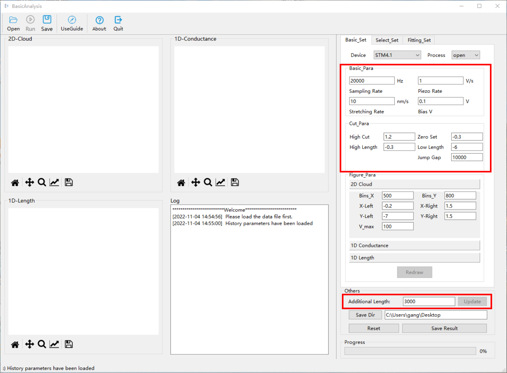

- Sometimes there are many messy data in the 2D graph obtained, in this case, you can adjust the parameters in the **Select_Set** panel.
  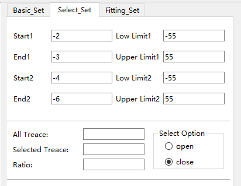

### 5. Load data

- Click the **open** button and select the files you want to process.
  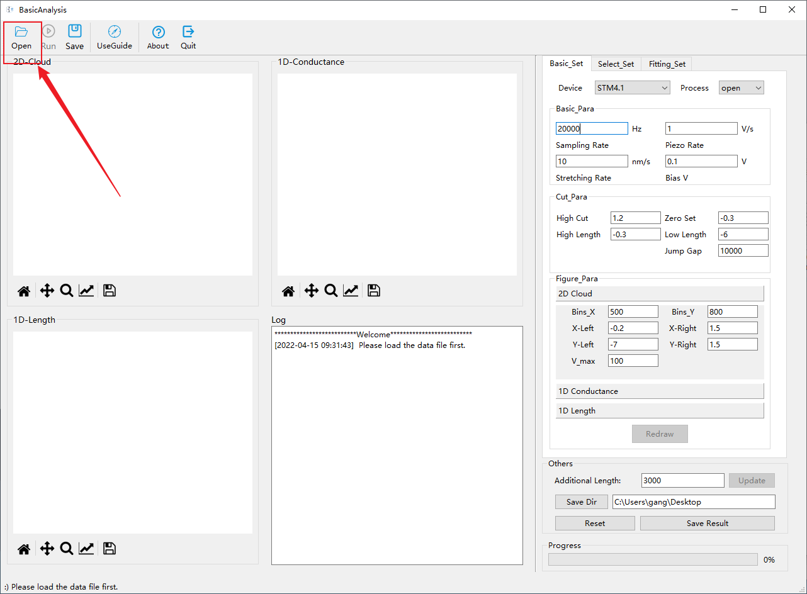

### 6. Run

- After setting parameters and loading data, click **run** button to start process.
  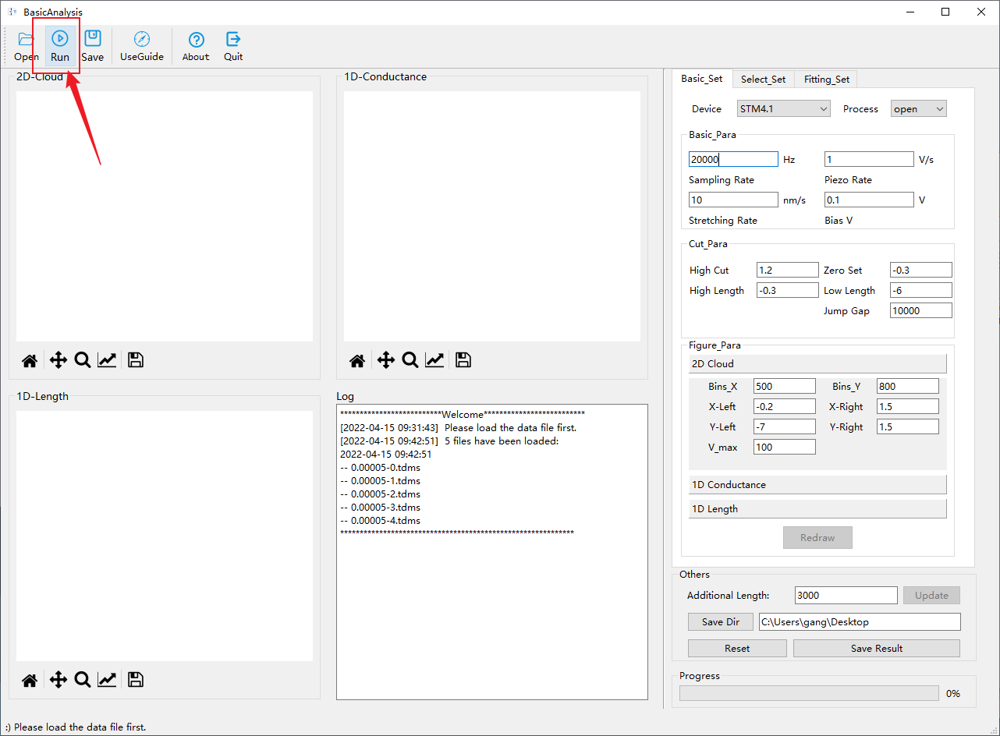

### 7. Adjust drawing parameters

- The results obtained by running directly are as follows, which may need to be adjusted
  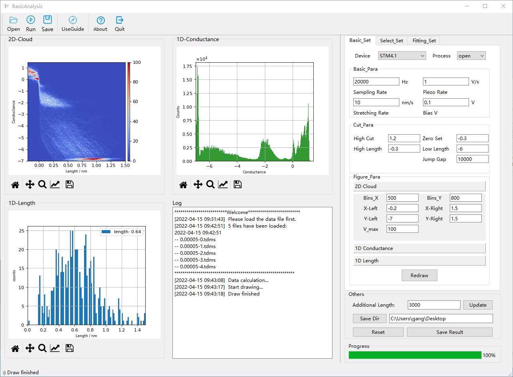

- You just need to adjust the parameters of the **Figure_Para** area and click the **Redraw** button, no need to start from scratch.
  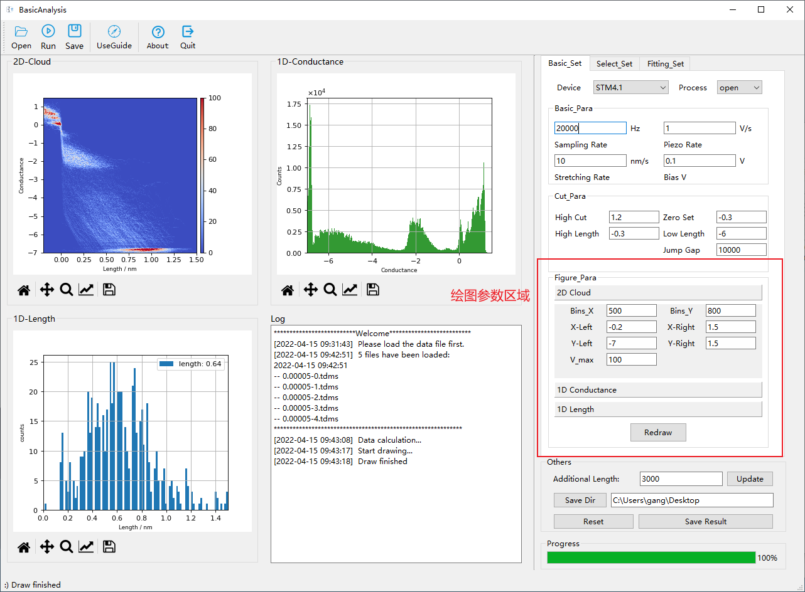

### 8. Save results

- Please set the storage path first, and then click the **Sava Result** button.
  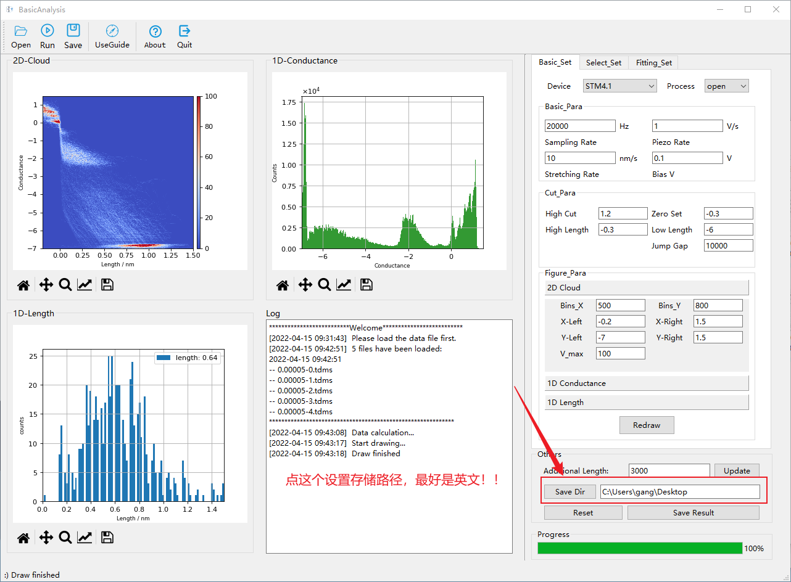

- Example of saving results:
  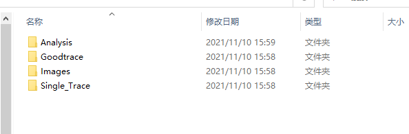

  
