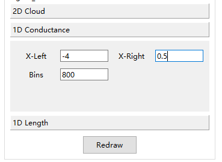
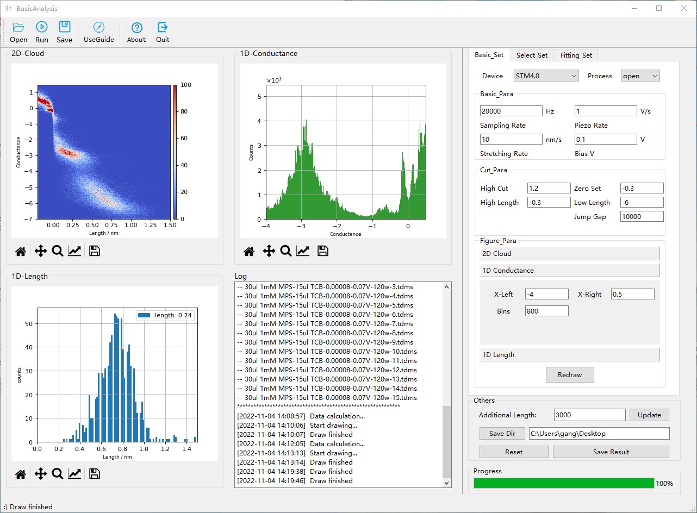
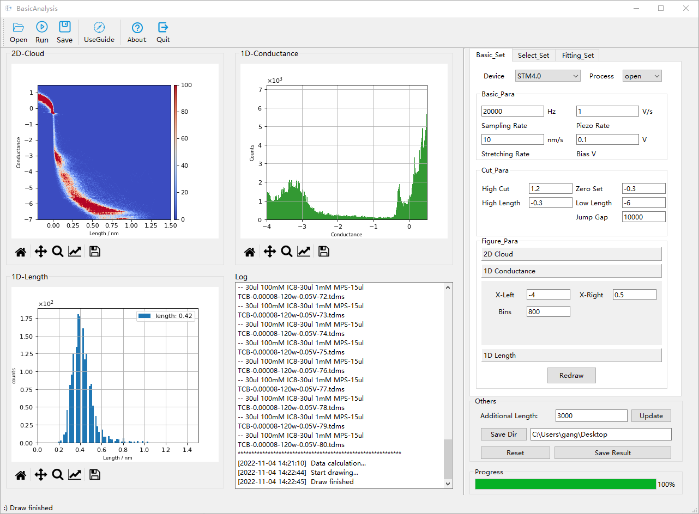
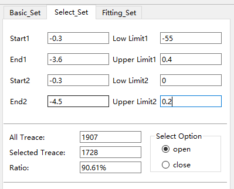
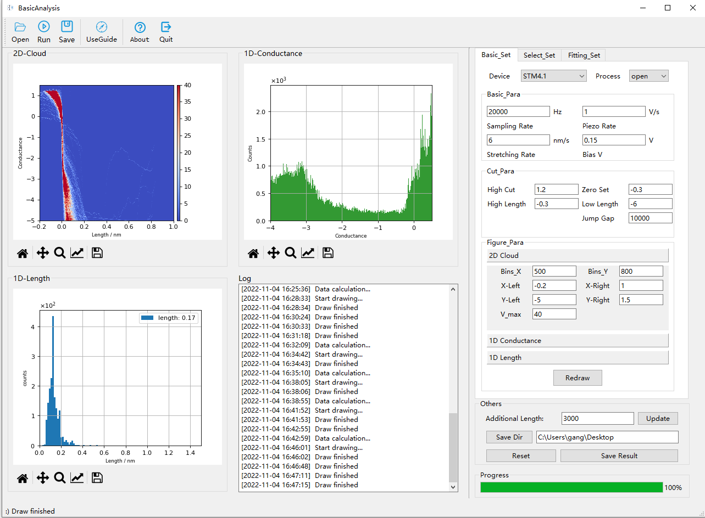

# Instructions

- Instructions on running the data are at:https://github.com/Pilab-XMU/XMe_DataAnalysis/tree/shangchi/guide

- The drawing parameters in the following three experiments are shown in the figure below.
  

- Before processing the raw data of MPP, please select STM40 in the **Basic_Set** panel.  
  

- Before processing the raw data at 60 minutes of response, please select STM40 in the **Basic_Set** panel.
  

- Before processing raw data from OMPP, select STM41 and set parameters in the **Basic_Set** panel  and the **Select_Set** panel as follow.
  

  